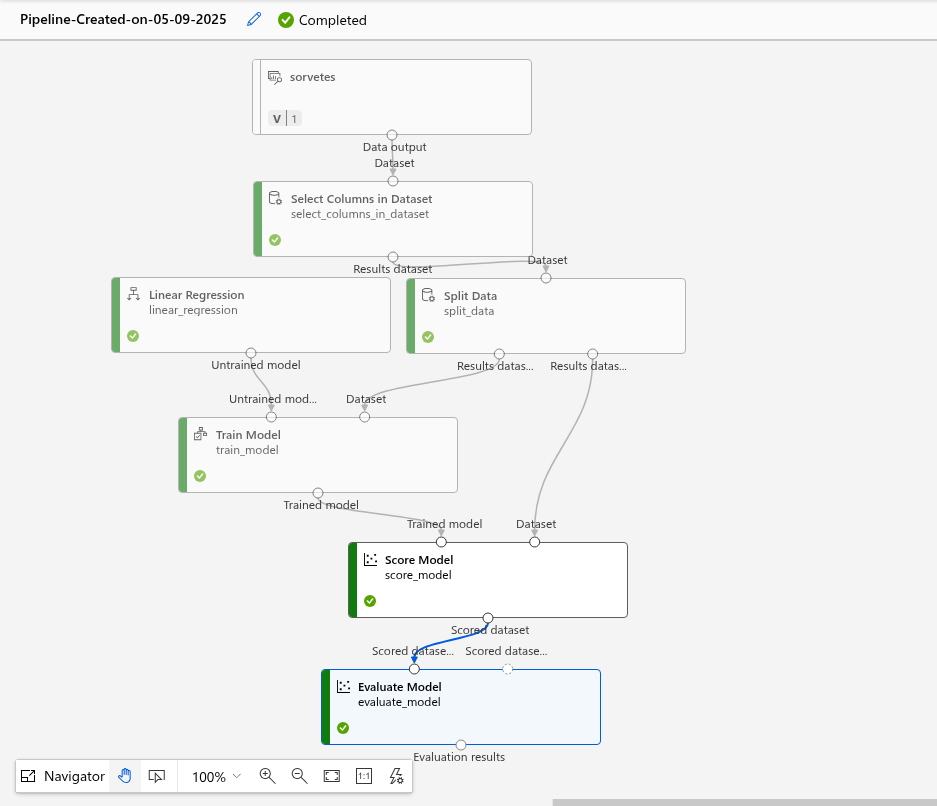
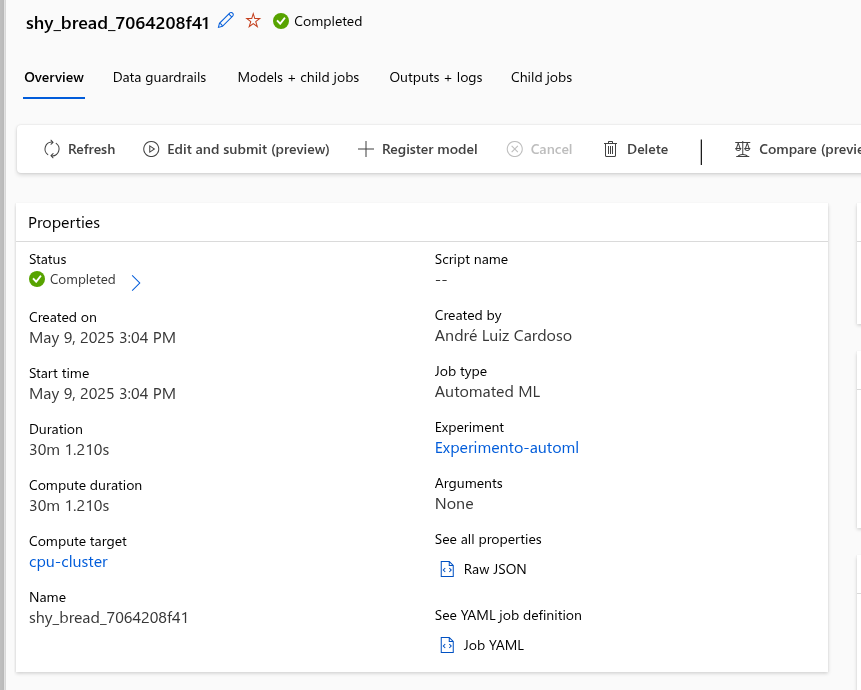
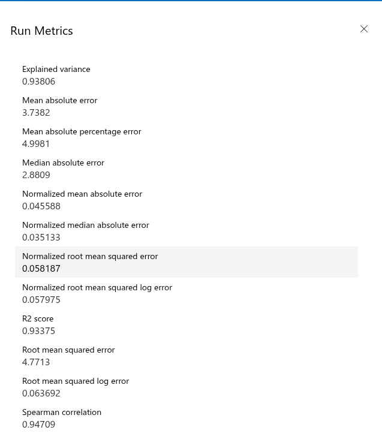

# Ice Cream Sales Forecasting with Azure AutoML

## 📅 Project Summary
This case study showcases the application of Azure Machine Learning (Azure ML) services to forecast ice cream sales based on temperature data. The project simulates a retail scenario, predicting product demand influenced by weather conditions. It includes two parallel approaches:

1. A manually designed pipeline using regression in Azure ML Studio
2. An automated experiment using Azure AutoML with model selection, tuning, and evaluation

Both methods aim to compare performance and validate the feasibility of automating machine learning workflows.

---

## 🔄 Business Context
In the ice cream industry, sales are highly dependent on temperature. Retailers and distributors often need accurate forecasts to adjust inventory, staffing, and marketing strategies. By building a regression model that learns the relationship between temperature and sales volume, this project provides an analytical solution to enhance business decision-making.

---

## 📚 Dataset Overview
- **Columns:**
  - `Date`
  - `Temperature (C)`
  - `Ice Cream Sales`
- **Records:** 100
- **Nature:** Simulated data with a positive correlation between temperature and sales volume

---

## 🌐 Environment & Tools
- **Platform:** Microsoft Azure ML Studio
- **Compute Target:** `cpu-cluster`
- **Language:** Python 3.9
- **Key Packages:**
  - `azureml-train-automl-runtime`
  - `scikit-learn`
  - `xgboost`, `prophet`, `mlflow`
  - `spacy`, `pytorch-transformers`
- **Environment File:** `conda.yaml`, `python_env.yaml`, `requirements.txt`

---

## ⚙️ Approach 1: Manual Pipeline (Azure ML Designer)

### Components Used
- Select Columns in Dataset
- Split Data (Training/Test)
- Linear Regression Module
- Train Model
- Score Model
- Evaluate Model

### Image:


### Outcome
- This approach served as a benchmark and functional test for predicting sales.
- The evaluation was done visually using RMSE and R² metrics (visible in Score Model and Evaluate Model modules).

---

## 🧑‍💻 Approach 2: Automated ML (AutoML Experiment)

### Experiment Metadata
- **Experiment Name:** `Experimento-automl`
- **Run ID:** `shy_bread_7064208f41_21`
- **Duration:** 30 minutes
- **Sampling:** 100%
- **Primary Metric:** `Normalized Root Mean Squared Error`

### Environment
- Image: `AzureML-ai-ml-automl`
- Hardware: `Standard_DS11_v2`

### Best Model Selected
- **Type:** `VotingEnsemble`
- **Asset URI:** [Model Link](https://ml.azure.com)

### Image:


---

## 📊 Metrics & Performance

### From AutoML Results:


| Metric                              | Value    |
|-------------------------------------|----------|
| Explained Variance                  | 0.93806  |
| Mean Absolute Error (MAE)           | 3.7382   |
| Median Absolute Error               | 2.8809   |
| Normalized RMSE                     | 0.05819  |
| Root Mean Squared Error (RMSE)      | 4.7713   |
| R² Score                            | 0.93375  |
| Spearman Correlation                | 0.94709  |

### Image:


These results confirm high predictive power and low error margins, making the model robust and suitable for deployment.

---

## 🧳 Additional Assets
- Trained model: `model.pkl`
- Evaluation files: `y_valid.pkl`, `X_valid.pkl`, `sample_weight_valid.pkl`
- Full training dataset (output): `full_training_dataset.df.parquet`
- Run configuration: `definition.json`, `automl_driver.py`

---

## 🔬 Key Learnings & Conclusion
- Azure ML Studio's **visual designer** is an excellent entry point for prototyping.
- **AutoML** provides a scalable, high-performance alternative that automatically selects and tunes models.
- The ensemble model outperformed manual regression, achieving a normalized RMSE of ~0.058 with R² > 0.93.
- The integration with MLflow and versioned model outputs facilitates reproducibility and deployment.

---

## 📁 Repository Structure
```
project-folder/
├── img/
│   ├── pipeline.png
│   ├── 01.png
│   ├── 02.png
│   └── 03.png
├── outputs/
├── logs/azureml/
├──automl_driver.py
├── cyan_truck_ptggd842xf.jsonl
├── definition.json
├── definition_original.json
└── README.md  ← (this file)
```

---

## 👇 Next Steps
- Register the best model in Azure ML Registry
- Deploy via ACI/AKS for real-time inference
- Integrate weather APIs to make real-time sales predictions

---

**Author:** André Luiz Cardoso  
**Date:** May 9, 2025
