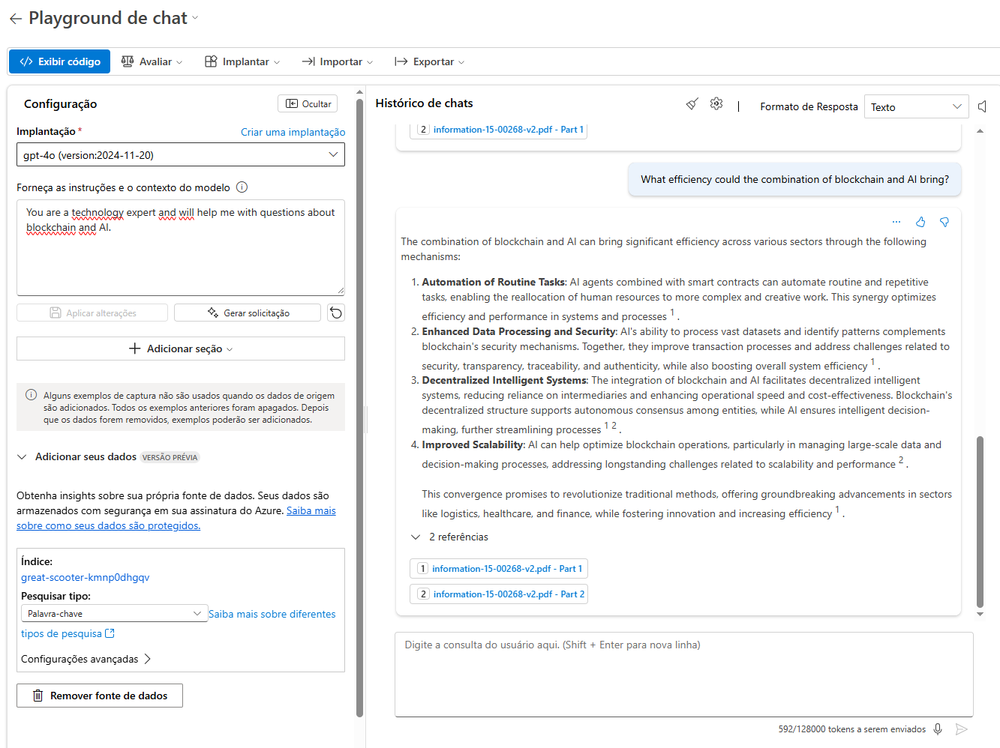

# AI + Blockchain Scientific Article RAG Chatbot

## 📌 Project Summary

This project implements a **Retrieval-Augmented Generation (RAG)** chatbot built with **Azure AI Foundry**, trained on embeddings generated from **three scientific articles** related to the integration of **Artificial Intelligence (AI)** and **Blockchain**. The chatbot provides contextual responses grounded in the source articles, simulating a knowledge assistant for research or technical recruiting use cases.

## 📚 Use Case: Smart Literature Analysis Assistant

Imagine you're a software engineering student or recruiter analyzing emerging tech intersections like AI and blockchain. Rather than manually reading dozens of papers, this assistant can help answer questions directly from scholarly sources — enabling fast insights with academic integrity.

### Original Challenge

> Build a chat interface that answers questions based on uploaded PDFs using embeddings and vector search, simulating a smart TCC assistant.

## 🧠 Data Sources

The RAG model was powered by vector embeddings from the following peer-reviewed articles:

1. **An Overview of AI and Blockchain Integration for Privacy-Preserving**  
   - [arXiv Preprint](https://arxiv.org/abs/2305.03928)  
   - Focus: Privacy and cryptographic frameworks in AI-Blockchain synergy

2. **Blockchain as a Platform for Artificial Intelligence Transparency**  
   - [arXiv Preprint](https://arxiv.org/abs/2503.08699)  
   - Focus: Using blockchain to improve AI explainability and regulatory compliance

3. **The Convergence of Artificial Intelligence and Blockchain: The State of Play and the Road Ahead**  
   - [MDPI Information, 2024](https://www.mdpi.com/2078-2489/15/5/268)  
   - Focus: A meta-analysis categorizing convergence stages and application domains

## ⚙️ Tech Stack

- **Platform:** Azure AI Foundry
- **Language Models:** GPT-4 via Azure OpenAI
- **Data Format:** PDF to embedding pipeline
- **Tools Used:**
  - Azure Cognitive Search
  - LangChain (via Azure wrapper)
  - Chat Playground for validation

## 🔍 Result Highlights

Below are test results showing the chatbot responding accurately based on scientific embeddings:

### 🔹 Sample 1


### 🔹 Sample 2


> The chatbot successfully extracted insights and provided source-based responses aligned with the input documents.

---

## 📈 Key Insights

- **Privacy and Compliance:** Integration of blockchain helps address AI’s “black box” problem by offering immutable traceability.
- **Scalability and Decentralization:** Federated architectures in both AI and blockchain can democratize access and security.
- **Real-world Applications:** The combined tech can enhance healthcare auditing, autonomous vehicle transparency, and smart legal systems.

---

## 📁 Repository Structure

```
azure-foundry-rag-chatbot/
├── inputs/                         # Raw PDF articles
├── print1_resized.png              # Screenshot 1
├── print2_resized.png              # Screenshot 2
└── README.md                       # This file
```

---

## ✅ What I Learned

- How to convert academic articles into structured data for AI retrieval
- Embedding strategies and chunking for long documents
- Integrating Cognitive Search with chat prompts
- Value of transparent AI for regulated domains

---

